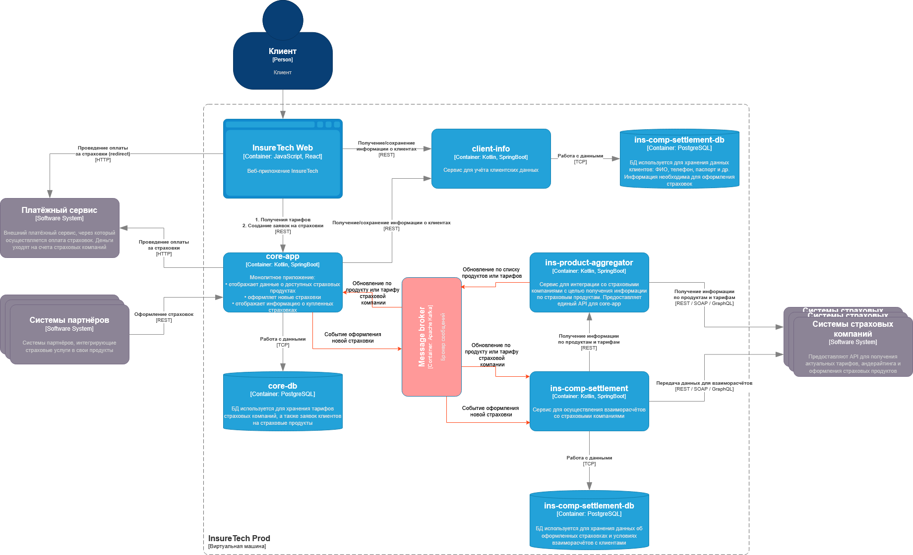

###Проблемы и риски роста нагрузки на систему InsureTech
В настоящий момент обновление реплик со списоком продуктов в обоих бизнес-сервисах выполняется за счет синхронных запросов 
к сервису-адаптеру ins-product-aggregator. В рамках каждого межсервисного запроса на обновление данных выполняется синхронный 
опрос сразу пяти внешних систем. Каждая из внешних систем может потенциально вернуть ошибку, что на данный момент приводит к 
ошибке всего процесса агрегирования данных о продуктах. Сами запросы потенциально могут быть очень долгими. Как следствие 
замедляется работа не только сервиса-адаптера, но также вызывающих сервисов. В случае с сервисом ins-product-settlement запрос 
данных производится 1 раз в сутки для построения суточной отчетности. Если запрос продуктов завершится ошибкой, ежедневный 
отчет вообще не будет построен, либо построится на сильно устаревших данных реплики. С ростом количества подключенных страховых
компаний проблемы усугубятся, так как вырастет количество опрашиваемых компаний, а значит время обработки и вероятность получения ошибки.

Также есть проблемы в ежедневном запросе ins-comp-settlement к core-app. Запрос также синхронный и предполагает получение данных 
о целом списке оформленных страховок. В случае дальнейшего возрастания нагрузки на систему, а вместе с ней роста количества оформленных страховок,
весьма вероятно, что ответ от core-app станет очень большим. Сбор и передача слишком больших объемов данных в синхронном 
взаимодействии может привести к задержкам ответов или к сетевым проблемам.

Данные проблемы можно решить посредством внедрения потоковой передачи данных и асинхронного взаимодействия.
1) Предлагается два варианта доработки взаимодействия по обновлению данных о продуктах:
     - перенести реплику с перечнем продуктов в ins-product-aggregator и полностью сделать его поставщиком данных о продуктах и тарифах.
       сервис будет самостоятельно опрашивать внешние сервисы с определенной периодичностью и обновлять у себя данные. 
       Полученные данные сервис сможет либо отдавать по запросу бизнес-сервисов, либо после каждого запроса оценивать изменения 
       и потоком пересылать их в выделенный топик кафки. Из кафки его могут читать все заинтересованные потребители. Такой
       подход с одной стороны решает вопрос несинхронизированности данных, зависания бизнес-сервисов на ожидании ответа 
       от внешних сервисов и множества потенциальных сетевых ошибок внешнего взаимодействия. Однако к минусам можно отнести
       тот факт, что меняется функциональность сервиса. Из межсистемного адаптера он превращается в поставщика данных. 
       Усложняется его структура и появляется объемная база данных.  
     - Сделать взаимодействие с ins-product-aggregator асинхронным с применением паттерна Transactional Outbox. Запрашивающие 
       сервисы в синхронном режиме будут присылать управляющий сигнал-заказ данных. Сервис ins-product-aggregator периодически будет
       искать запросы на получение данных и обрабатывать их без "подвешивания" запрашивающих сервисов в ожидании. 
       После полного сбора запрошенной информации (который потенциально может подразумевать длительную обработку и 
       повторные запросы к внешним системам в случае ошибки), сервис-адаптер сам вызовет запрашивающий сервис и передаст ему полученную информацию.
       Из плюсов - описанные проблемы будут решены, при этом функциональная составляющая сервиса не изменится. Из минусов - 
       БД все равно появится (для обеспечения работы Transactional Outbox). С ростом количества подключенных компаний будет
       расти объем передаваемой информации, что черевато ошибками при ответе от адаптера к бизнес-сервису.
       
    Первый вариант на мой взгляд выглядит более перспективным, так как дает больше гибкости и потенциальной масштабируемости.

2) Сервис ins-comp-settlement раз в сутки осуществляет запрос в core-app по REST API для получения всех оформленных за день страховок.
   Такой функционал обычно не предполагает асинхронного взаимодействия с долгим ожиданием ответа. В качестве варианта ускорения 
   Обработки запроса списка страховок и уменьшения вероятности ошибок предлагается реализовать потоковое получение данных. 
   Сервис core-app по факту оформления новой страховки будет публиковать соответствующее событие в брокер сообщений (Kafka).
   Сервис ins-comp-settlement будет вычитывать информацию и сохранять для последующего построения отчета. Чтобы не раздувать 
   БД сервиса можно организовать ежесуточную очистку данных после формирования необходимых отчетов.
   
Пример варианта доработки взаимодействия сервисов:
